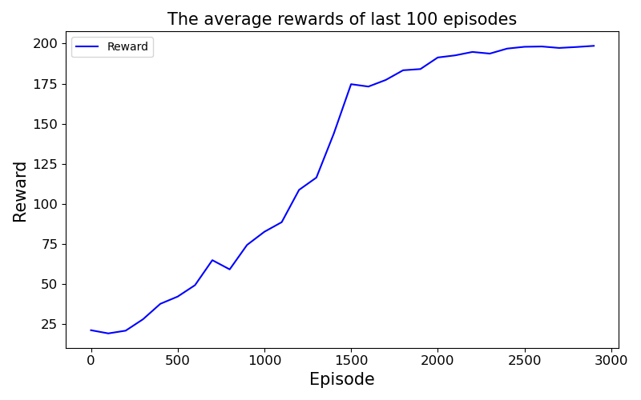

The ActorCritic algorithm with policy and q-network parameterized by 1 layer Artificial Neural Network.
## Environment: OpenGYM [CartPole-v0](https://github.com/openai/gym/blob/master/gym/envs/classic_control/cartpole.py) 
**state space**

|Num|Observation|Min|Max|
|:----|:----|:----|:----|
|0|Cart Position|-4.8|4.8|
|1|Cart Velocity|-Inf|Inf|
|2|Pole Angle|-0.418 rad (-24 deg)|0.418 rad (24 deg)|
|3|Pole Angular Velocity|-Inf|Inf|

**action space**

|Num|Action|
|:----|:----|
|0|Push cart to the left|
|1|Push cart to the right|

**reward**: Reward is 1 for every step taken, including the termination step

## Run
~~~
> (optional) cd actorcritic
> python train.py --dim_hidden 128 --gamma 0.98 --lr 0.0002 --n_episodes 3000 --print_interval 100 --render 0
~~~

## Result
**The average rewards of last 3,000 episodes**

**Simulation after 3,000 episodes**
> To be posted ASAP
        